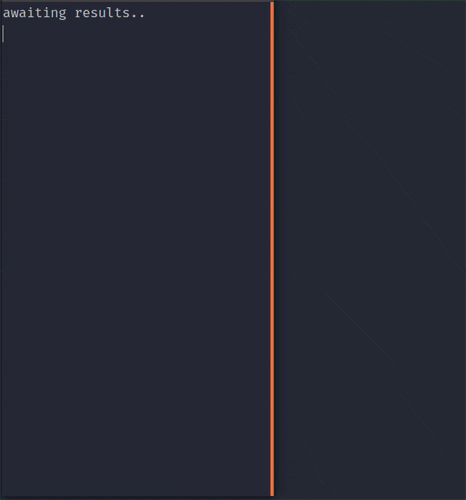
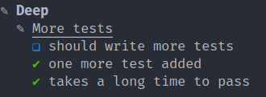

# slim-reporter

This TAP reporter was designed to:

- take as little space in width as possible
- have the text wrap properly
- have a strong visual structure
- display a hierarchical view of test results

## How it looks
I have run the tests serially with a delay to produce this animation. Note that the hierarchical view supports concurrent tests. It was one of the motivations for this reporter.



## How to install

```
npm install --save-dev https://github.com/geoffreyTools/slim-reporter.git
```


## How to use
You can pipe it to your test runner's TAP output stream.

Example with AVA in a `package.json`:
```json
{
    "scripts": {
        "test": "ava --tap | slim-reporter"
    }
}
```

## legend





|  icon  | meaning                                 |
|:------:|-----------------------------------------|
| **✎**  | mixed, non-failing, test results        |
| **⚑**  | tests actually run                      |
| **✔**  | passed tests (including expected fails) |
| **⨯**  | failed tests                            |
| **\>** | skipped tests                           |
| **❏**  | todos                                   |

## Options
Options can be passed as arguments to slim-reporter like so:
```bash
ava --tap | slim-reporter theme=light verbose resize indent=4
```

### theme
The default theme has a `light` and `dark` variant that you can trigger like so 
```json
ava --tap | slim-reporter theme=light
```
You can also create your own theme file with any number of variants.
- name it `slim-reporter-theme.json`
- place it at the root of your project
- you can find a sample file [here](./readme/slim-reporter-theme.json)
- the array values are respectively Hue, Saturation and Lightness (HSL colour model)

### verbose
By default, the output only includes errors + the summary.

You can add the hierarchical report and logs with the `verbose` option.
```json
ava --tap | slim-reporter verbose
```

### resize
By default, if you resize the Terminal window, the layout will not be recomputed (banners, text wrap). You can change this with the `resize` option:
```json
ava --tap | slim-reporter resize
```
This option is only recommended when you set up your workspace, because `resize` prevents the output stream from ending.

### indent
The default indentation is `2`, you can override it like so:
```json
ava --tap | slim-reporter indent=4
```

### max-width
You can set a maximum line width in number of columns if you like to stretch your Terminal window. The banners will stop and the text will wrap at this length.
```json
ava --tap | slim-reporter max-width=60
```

## Dependencies

This project relies on [tap-parser](https://github.com/tapjs/tap-parser) and uses [chalk](https://github.com/chalk/chalk) extensively.